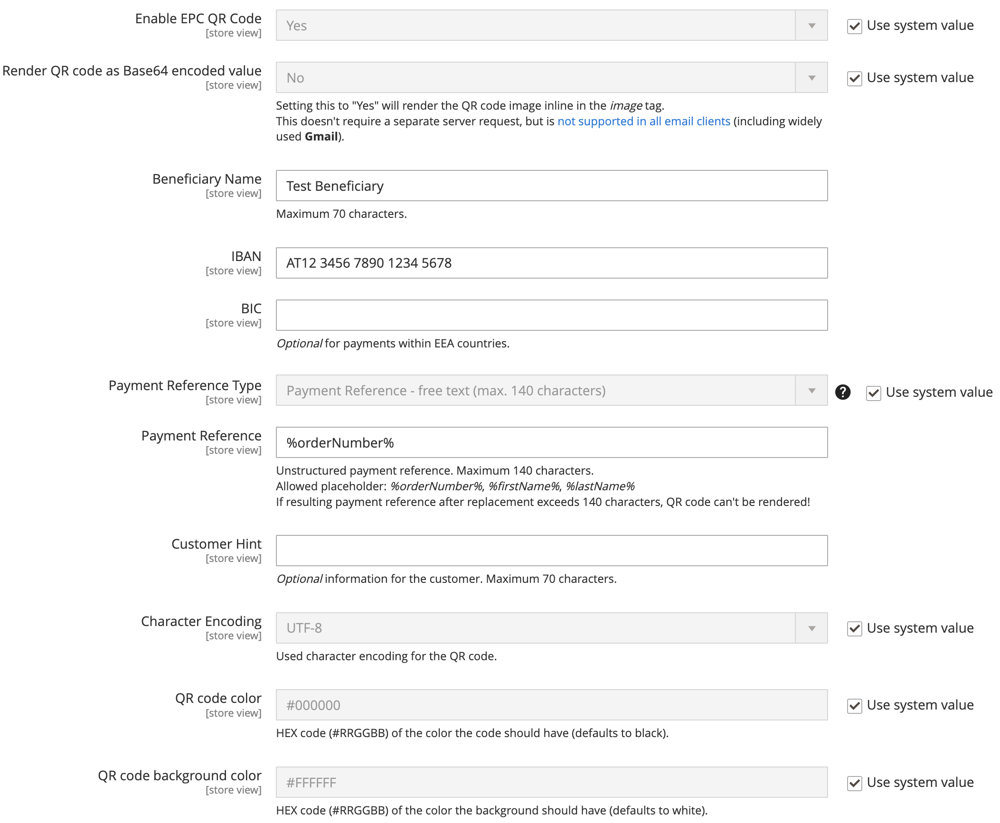
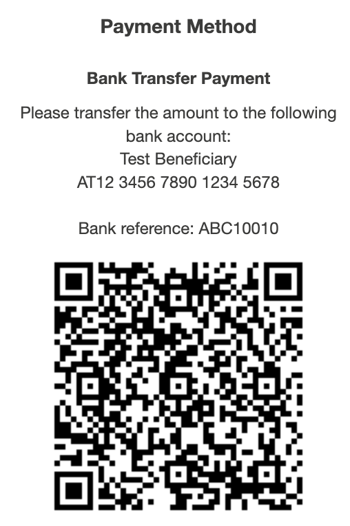

<h1 align="center">SchrammelCodes_EpcQrCode</h1> 

<div align="center">
    <p>Enables merchants to provide an EPC QR code for banktransfer payments to customers.</p>
    
    <a href="https://packagist.org/packages/schrammel-codes/magento2-epc-qr-code" target="_blank"></a>
    <a href="https://packagist.org/packages/schrammel-codes/magento2-epc-qr-code" target="_blank"></a>
    <a href="https://github.com/schrammel-codes/magento2-epc-qr-code/graphs/commit-activity" target="_blank"></a>
    <a href="https://opensource.org/licenses/MIT" target="_blank"></a>
</div>

## Table of contents
* [📝 Summary](#summary)
* [ℹ️ Background](#background)
* [👨🏼‍🔧 Installation](#installation)
* [🛠️ Configuration](#configuration)
* [🗓️ Usage](#usage)
* [⛙ Contribution](#contribution)
* [⚖️ License](#license)

## 📝 Summary
To ease payments for customers, merchants can provide an EPC QR code for banktransfer payments.  
This module adds new configurations to the `Banktransfer` payment method, which generates an EPC QR code for the
customer to scan with their banking app.

## ℹ️ Background
[EPC QR codes (PDF)](https://www.europeanpaymentscouncil.eu/sites/default/files/kb/file/2022-09/EPC069-12%20v3.0%20Quick%20Response%20Code%20-%20Guidelines%20to%20Enable%20the%20Data%20Capture%20for%20the%20Initiation%20of%20an%20SCT_0.pdf)
are a standardized way to provide payment information to customers. The generated QR code contains all the information
needed to make a banktransfer payment, such as the beneficiary, IBAN, the transaction amount and the reference.  
The customers simply can scan the QR code with their banking app to initiate the payment.

## 👨🏼‍🔧 Installation
```
composer require schrammel-codes/magento2-epc-qr-code
bin/magento module:enable SchrammelCodes_EpcQrCode
bin/magento setup:upgrade
```

## 🛠️ Configuration
This module adds additional configurations to the `Banktransfer` payment method in
`Stores > Configuration > Sales > Payment Methods > Bank Transfer Payment`.



`Render QR code as Base64 encoded value` has to be used with caution. It is recommended to use this option only, if it's
that your customers don't get a QR code rendered in Gmail clients, as the most widely used email client [not supporting
`base64` encoded images](https://www.caniemail.com/features/image-base64/) as image source.

> When using colors for your QR code, make sure it is easy to scan. Some color combinations might make it hard to
impossible for the banking apps to process the QR code.

## 🗓️ Usage
As soon as the module is enabled and configured with correct information, the QR code will be rendered below the 
banktransfer payment instructions in every place they are rendered.

  
> Please observe, that the above shown QR code is an example and does not contain a valid IBAN which results in an error
scanning this code with a banking app. With correct configuration, the QR code will work as intended.

Further, the module offers a view model `\SchrammelCodes\EpcQrCode\ViewModel\QrCode` with following methods that can be
used to render the QR code image tag in the frontend:
* `renderQrCodeImageTagFromOrderIncrementId(string $orderIncrementId): ?string`
* `renderQrCodeImageTagFromOrder(\Magento\Sales\Api\Data\OrderInterface $order): ?string`

If the prerequisites to render the QR code are not met, the methods will return `null`.

## ⛙ Contribution
Contributions are welcome! If you have any suggestions, feature requests or issues, please [create a new issue](https://github.com/schrammel-codes/magento2-epc-qr-code/issues)
or [submit a pull request](https://github.com/schrammel-codes/magento2-epc-qr-code/pulls).

## ⚖️ License
[MIT](https://opensource.org/licenses/MIT) Copyright (c) 2024 Dipl.-Ing. Andreas Schrammel, BSc.
